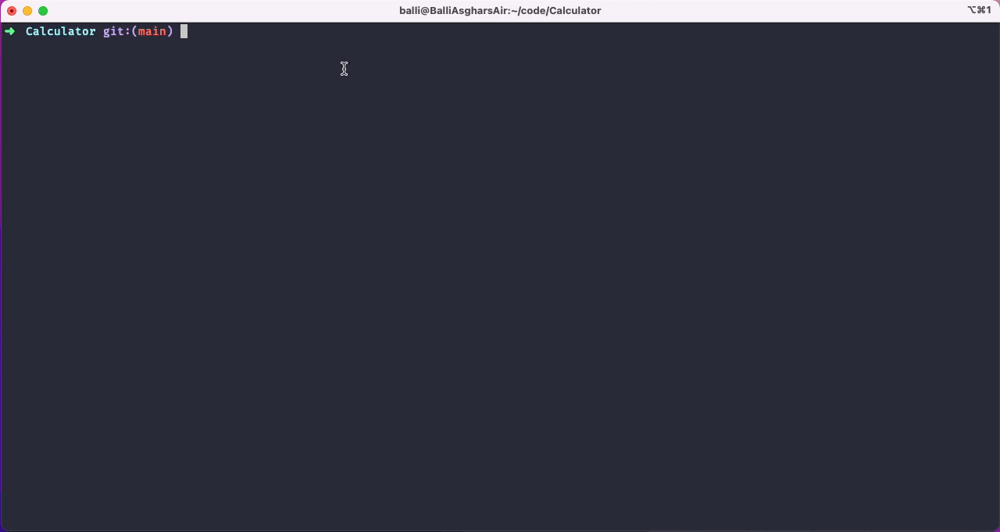

# A Simple Calculator

This is a simple calculator that can perform addition, subtraction, multiplication, and division.

## How to use

### Clone the repository

```bash
git clone https://github.com/BalliAsghar/Calculator
```

### Move to the directory

```bash
cd Calculator
```

### Install the dependencies

```bash
npm install
```

# Usage
Run the following command to open the Calculator in interactive mode
    
```bash
node index.js
```
**Note**: You can also use `npm install -g` to install the package globally and then use `calc` command to run the program from anywhere.

## Calculator in interactive mode



In interactive mode, you can perform multiple operations one after another. To exit the interactive mode, press `Ctrl + C`. or select `Exit`


**Note**: First type the first number, then select the operation, and then type the second number. The result will be displayed on the screen. then the result will be used as the first number for the next operation.

## Command Mode

## Available Commands

- `add` - Adds two numbers or more
- `sub` - Subtracts two numbers or more
- `mul` - Multiplies two numbers or more
- `div` - Divides two numbers or more
- `help` - Displays the help menu

## Command Usage

```bash
node index.js add 10 5
```

## Limitations

- The calculator can only perform one operation at a time. means, you can't add and subtract at the same time. e.g. `node index.js add 10 5 sub 2 1`
- The calculator can only accept numbers with spaces between them. For example, `add 25 43` is valid, but `add 25,43` is not.