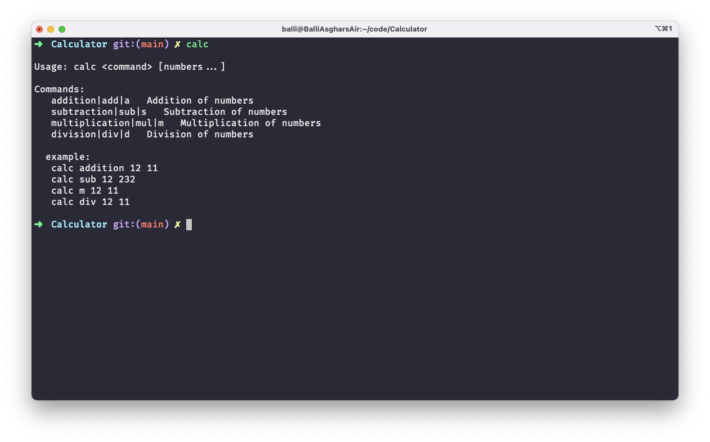

# A Simple Calculator

This is a simple calculator that can perform addition, subtraction, multiplication, and division.

## How to use

### Clone the repository

```bash
git clone https://github.com/BalliAsghar/Calculator
```

### Move to the directory

```bash
cd Calculator
```

### Install the dependencies

```bash
npm install
```

# Usage
Run the following command to show the help
    
```bash
node index.js
```
**Note**: You can also use `npm install -g` to install the package globally and then use `calc` command to run the program from anywhere.



Example:

```bash
node index.js add 25 43
```

## Limitations

- The calculator can only perform one operation at a time.
- The calculator can only accept numbers with spaces between them. For example, `add 25 43` is valid, but `add 25,43` is not.